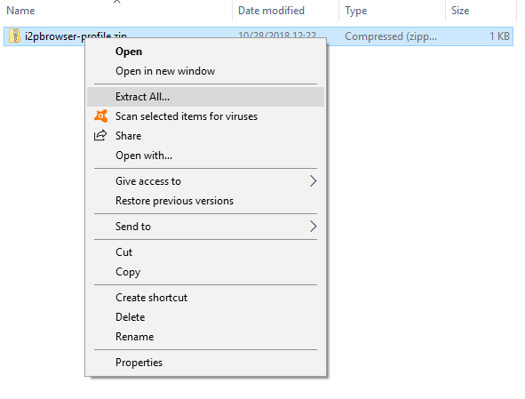
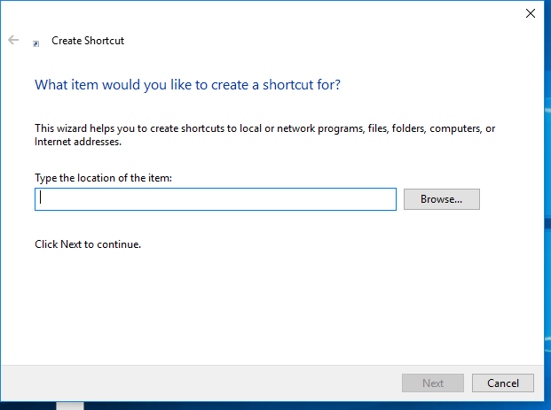

# firefox.profile.i2p

The profile should be safe to use, and the Windows guide works if exectuted
correctly on Windows 10. There is an easy, straightforward, and relatively
foolproof way to automate the Windows installation process, but I can't test it
until like, Wednesday.

**DEFINITELY DON'T USE ANYTHING PRODUCED BY THE MAKEFILE YET. I WILL BE**
**TRYING OUT THE MSI TRICK ON WEDNESDAY.**

### Manual Setup (Windows) [Standalone guide](WINDOWS.md)

  0. Install Firefox ESR on your platform. [It can be obtained here](https://www.mozilla.org/en-US/firefox/organizations/)
  ESR stands for Extended Support Release, and it's the most "stable" branch of
  Firefox. If you already have Firefox ESR, you can safely skip this step.
  1. Download the profile release bundle from here. It is a zip file, which
  contains the profile we will be using with Firefox for our i2p-based browsing.
  2. Right-click the i2pbrowser-profile.zip and unzip the the profile into your
  Documents/Downloads folder by selecting "Extract All." You should be
  extracting this directly into your "Downloads" Folder, where the zipped file
  will create it's own subfolder automatically.



  3. Go to your desktop, right click, and select "Create Shortcut." Where it
  says "Type the location of the item:," Copy and paste the following line

        "C:\Program Files (x86)/Mozilla Firefox/firefox.exe" -no-remote -profile %CSIDL_DEFAULT_DOWNLOADS%/firefox.profile.i2p

Before:


After:


  4. Click "Done" and double-click your new shortcut. Type i2p-projekt.i2p into
  the address bar to test your i2p connectivity.

### Manual Setup (OSX) [Standalone guide](MACOSX.md)

  0.
  1.
  2.
  3.

### Manual Setup (Various Linuxes) [Standalone guide](LINUX.md) (Debian-Derived distros see Footnote #2)

*NOTE: I'm probably going to add an apparmor profile to this setup for optional*
*installation.*

  0. Install Firefox-ESR via the method preferred by your Linux distribution.
  1. Download the i2pbrowser-gnulinux.zip from here. If you prefer, an identical
  i2pbrowser-gnulinux.tar.gz is also available.
  2. Extract it.
  3. Run ./install.sh install from within the extracted folder. Alternatively,
  run ./install.sh run to run entirely from within the current directory.

#### Footnotes

##### Differences from Tor Browser

TL:DR There is no security slider, and to compensate for this issue, the Browser
is configured to enable fewer features by default.

This browser takes cues from the Tor Browser, which is also a reasonable choice
for an i2p browser, but it has some absolutely critical differences from the Tor
Browser which will probably not come into play, but which you should be aware
of. First, there is no Torbutton, which means that this browser lacks the coarse
global controls of sensitive browser features that the Torbutton provides to the
Tor Browser Bundle. In order to deal with this issue the default NoScript
configuration is more restrictive.

##### Debian/Ubuntu users

If you are using Debian or Ubuntu, or probably any other up-to-date apt-based
Linux distribution, there's another option which may you may prefer. In order to
do this, one must add the Whonix apt package repository to your package sources,
and install their tb-starter package from their stretch-testing repository.
Don't worry, I'll take you through it step-by-step.

Or, you can just run these commands, now that you know what they do:

```sh
sudo apt-key --keyring /etc/apt/trusted.gpg.d/whonix.gpg adv --keyserver hkp://ipv4.pool.sks-keyservers.net:80 --recv-keys 916B8D99C38EAF5E8ADC7A2A8D66066A2EEACCDA
echo 'deb http://deb.whonix.org stretch-testers main' | tee /etc/apt/sources.list.d/whonix-testing.list # apt-transport-* season to taste
sudo apt-get update
sudo apt-get install tb-starter
```
